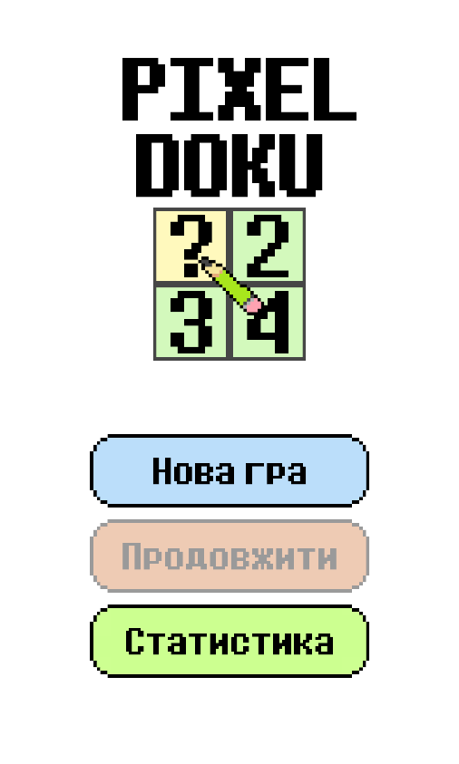
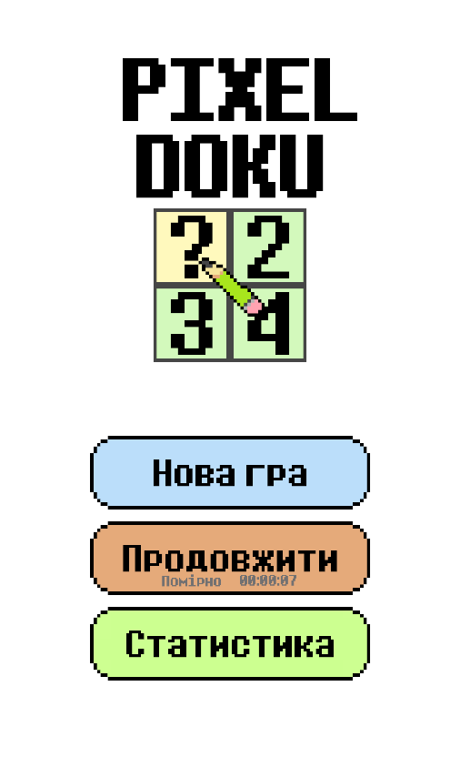
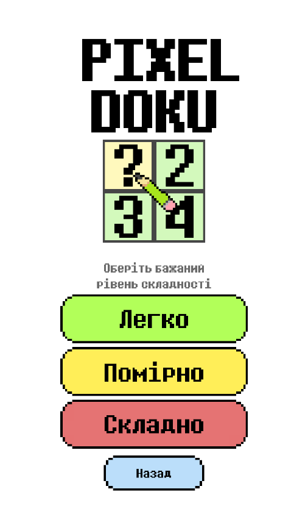
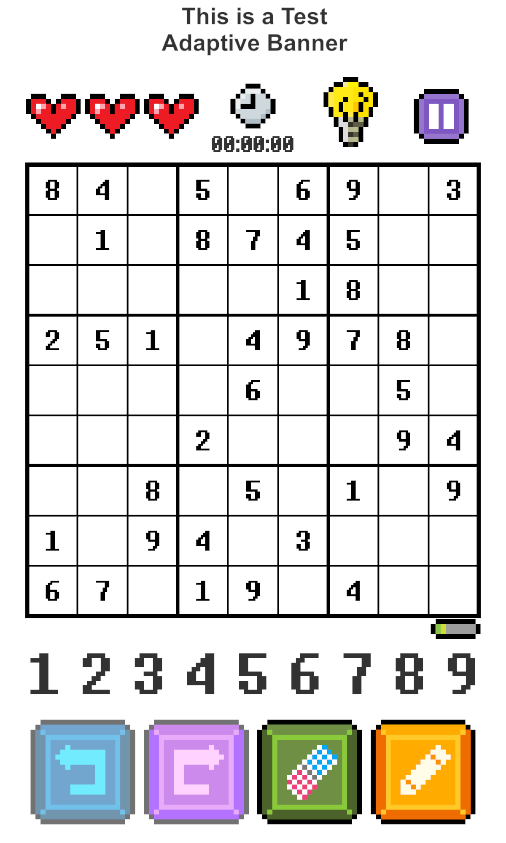
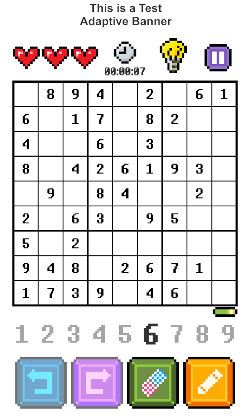
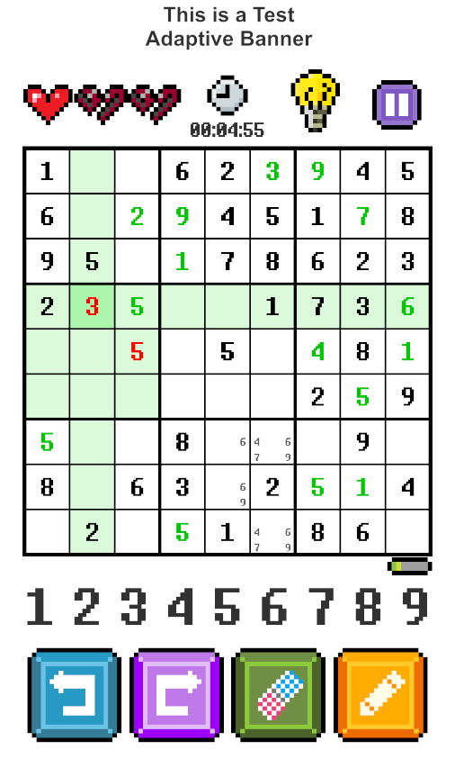
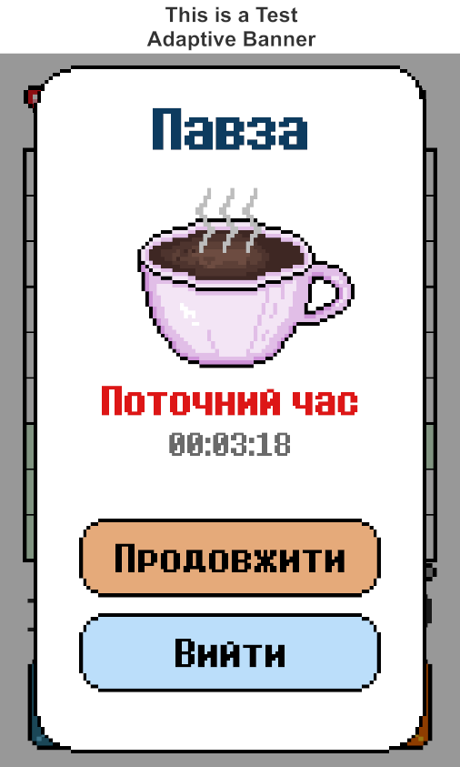
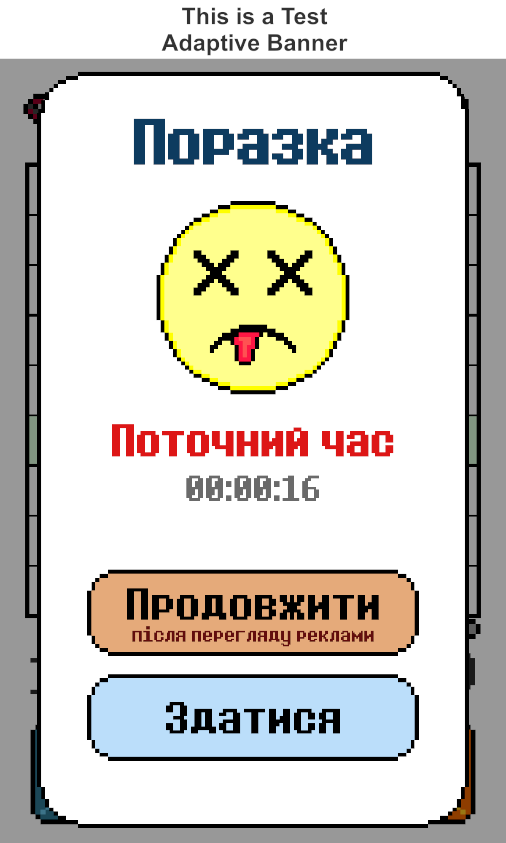
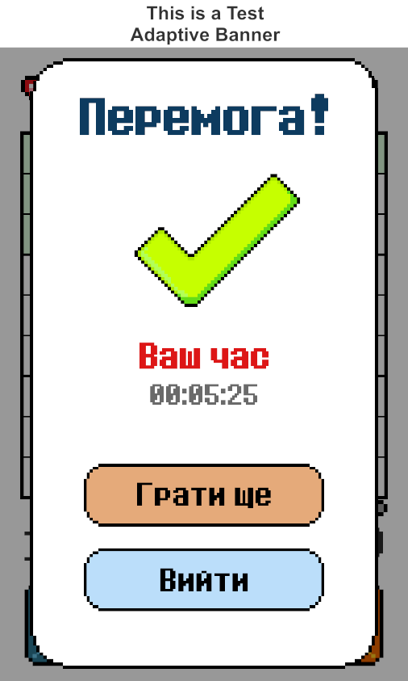
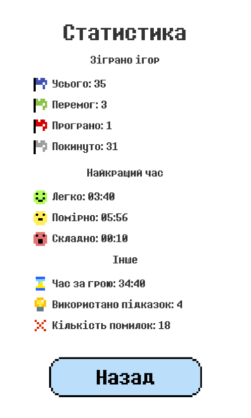

# PixelDoku - мобільна гра «Судоку»

PixelDoku - мобільна гра-головоломка жанру судоку для платформи Android, виконана у піксельному стилі. Підтримує три рівні складності, два режими введення цифр, систему підказок, скасування/повторення ходів, автозбереження прогресу та облік ігрової статистики.

Проєкт розроблений як кваліфікаційна робота бакалавра за спеціальністю 122 «Комп'ютерні науки» (Національний університет «Полтавська політехніка імені Юрія Кондратюка»).

## Скріншоти

### Головне меню

| Без збереження | Зі збереженням | Вибір складності |
|---|---|---|
|  |  |  |

### Ігровий процес

| Початок гри | Режим NumberFirst | Посеред гри |
|---|---|---|
|  |  |  |

### Попапи

| Павза | Поразка | Перемога |
|---|---|---|
|  |  |  |

### Статистика

## Технології

- Unity - рушій розробки
- C# - мова програмування
- MVC + Event Bus - архітектурні патерни
- PlayerPrefs + JSON - система збереження даних

## Як запустити

### APK-білд

Готовий APK-файл для встановлення на Android не доступний у [Releases](../../releases).

### Збірка з коду

1. Встановіть Unity (рекомендована версія вказана в ProjectSettings/ProjectVersion.txt)
2. Відкрийте проєкт через Unity Hub
3. Оберіть платформу Android у File → Build Settings
4. Натисніть Build або Build and Run

## Архітектура

Проєкт побудований на патернах MVC та Event Bus:

- Model - SudokuPuzzle, SudokuBoard, SudokuCell
- View - SudokuGridView, SudokuCellView
- Controller - SudokuGameState

Комунікація між компонентами реалізована через статичний клас GameEvents, що виконує роль шини подій - компоненти підписуються на потрібні події без прямих залежностей одне від одного.

Генерація головоломок виконується у два етапи: побудова повністю заповненої сітки на основі детермінованого шаблону з симетричними трансформаціями (SolvedGridGenerator), а потім видалення цифр з перевіркою унікальності розв'язку (UnsolvedGridGenerator, SudokuSolver).

## Ліцензія

© 2026 ExplXxb. Усі права захищено. Код доступний для перегляду в освітніх цілях; будь-яке використання, копіювання чи розповсюдження без письмової згоди автора заборонене.
